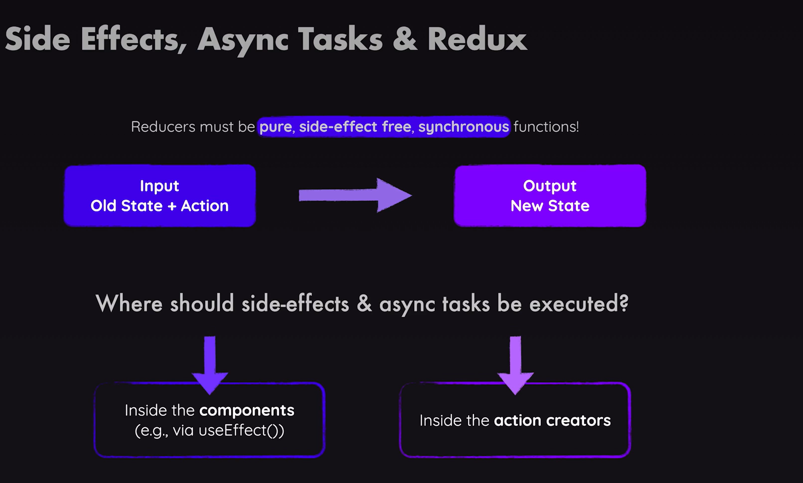
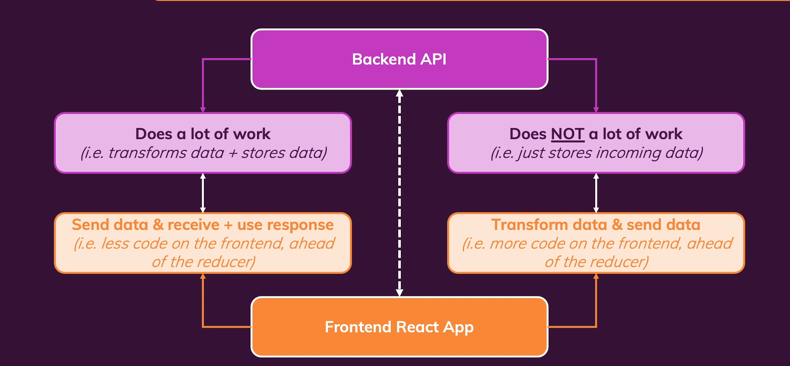
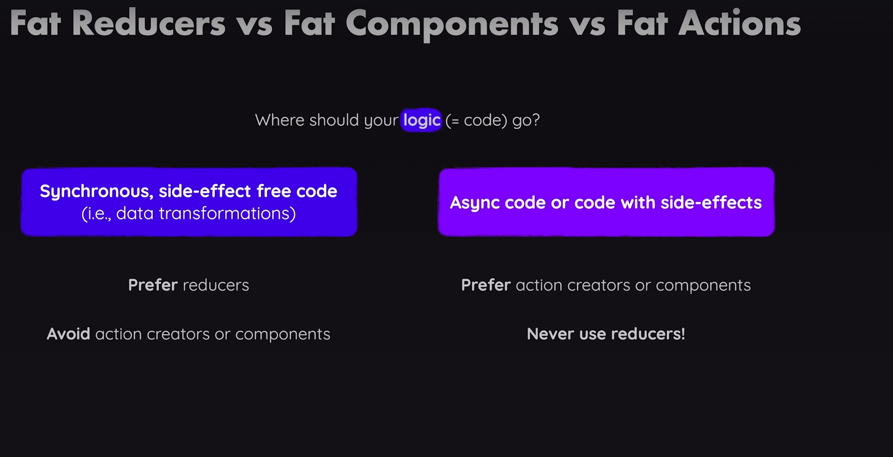

# REDUC DEEP DIVE

- Handling **Async Tasks** with Redux
- Wher to **Put Your Code**
- The Redux **DevTools**

1. Redux & Side Effects (and Asynchronous Code)

- Reducers must be **pure, side-effect free, synchronous** functions

### Using Firebase as a Backend

we'll use a third-party service called [Firebase](https://firebase.google.com/) as a dummy backend.

You can get started with Firebase for free - all you need is a Google account.

Then, once logged in with Google, you can create a new project with the default settings. Though you can disable "Google Analytics".

Thereafter, click "Build" and select "Realtime Database" and click "Create Database".

The region doesn't matter but make sure to create the database in "Test mode"!

This will create the database with a connected REST API that we'll use throughout this section.

You can then use the URL displayed on the screen in your React code to send requests to that database.

#### Frontend Code Depends On Backend Code

#### Where to put Code?

#### Using useEffect() with Redux

- we get the updated state from REDUX using the useSelector, and send the request to the backend whenever the state changes.

#### A Problem with useEffect()

We face one problem when using useEffect the way we currently do it: It will execute when our app starts.

Q. Why is this an issue?

It's a problem because this will send the initial (i.e. empty) cart to our backend and overwrite any data stored there.

#### Handling HTTP States & Feedback with Redux

- Add a separate component for Notificatin, where we handle all different kinds of notifications e.g Pending, Success, Error.
- Create a new state in out **ui-slice** REDUX with name **notification** and add a reducer with the name **showNotification**.
- Use the notification state and the notification reducer function inside of the **app component**.
- Display all the relivent notification with the **useDispatch** hook, and dispatch all the relivent data which we define in the action.payload.

#### Using an Action Creater Thunk

- e.g `uiActions.showNotification({...})` are automatically created action creators.
- Now we can also write our own action creators and we can write them to create so-called **thunks**.
  Q. What is a **Thunk** and why we want to do that?
  - A function taht **delay an action** until later, until something else finished.
  - And we couldl write an action create as a thunk, to write an action creator, which does not immediately return the action object, but which instead returns another function which eventually returns the action.
  - So that we can run some other code, before we then dispatch the actual action object that we did want to create.

**Example**

- We can use a function `export const sendCartData = (cart) => {}` that returns another function as an action as well.
  `export const sendCartData = (cart) => { return () => {}}`

- That is built into **REDUX** when using **REDUX TOOLKIT**

#### Getting Started with Fetching Data
